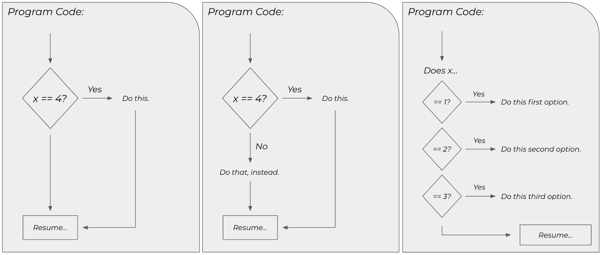

# If Statements

## Comparison Operators

Before we dive into conditional control structures, we need to spend some time reviewing basic comparison operators. These generally fall into one of two categories: relational operators and logical operators.



### Relational

Relational operators run the gamut of equality, inequality, and comparison operators, much like you'd see in a mathematics course.

| **Operator** | **Description** |
| :--- | :--- |
| `==` | Tests if two values are equal. |
| `===` | Tests if two values are equal and of the same type. |
| `!=` | Tests if two values are unequal. |
| `!==` | Tests if two values are unequal and of different types. |
| `<` | Tests if one value is less than another. |
| `<=` | Tests if one value is less than or equal to another. |
| `>` | Tests if one value is greater than another. |
| `>=` | Tests if one value is greater than or equal to another. |

JavaScript is unique in that it has two equality \(and inequality\) operators: `==` and `===` \(or `!=` and `!==`\). It's best to use `===` or `!==`, which is called strict equality \(or inequality\). It leads to overall cleaner code with fewer tough-to-track-down bugs.



### Logical

Logical operators work specifically with boolean expressions and values. The `&&` and `||` operators work with two expressions, while the `!` operator works with just one.

| **Operator** | **Description** |
| :--- | :--- |
| `&&` | True if both expressions are true. |
| `||` | True if at least one expression is true. |
| `!` | Negates the value of an expression. |

Their usage will make a lot more sense when we get to `if` statements, but consider the following example.

```javascript
const a = 3;
const b = 7;
const c = 12;
const d = 21;

const x = (a < b) && (c < d);   // a is less than b and c is less than d,
                                // so x is true
const y = (a > b) || (c < d);   // a is not greater than b but c is less
                                // than d, so y is true
const z = !(a < d);             // a is less than d and that result is
                                // negated, so z is false
```

Again, these will be used extensively when we get to conditional control structures.



## If Statements

Until now, your programs have been entirely linear. The code executed one statement at a time in the order they were written. As you might imagine, this can become somewhat restrictive when trying to create more complicated programs. You need to be able to control the flow of execution.

VIDEO

JavaScript provides several constructs that allow you to selectively execute one or more lines of code based on the state of the program. The most prominent conditional control structures are `if` statements and their variants.

* `if`
* `if/else`
* `if/else if`

Essentially, a conditional control structure introduces branching into your program. There can be a single branch \(`if`\), two branches \(`if/else`\), or multiple branches \(`if/else if`\).



### Single Branches

An `if` statement introduces a single conditional branch into the logic of your program. It takes the following form.

```javascript
if (condition) {
    // only executed if condition evaluates to true
}
```

The condition of an `if` statement can be any expression that evaluates to either `true` or `false`. This can be a variable, a combination of comparison operator expressions, or the value returned by a method.

The body of the `if` statement \(i.e., the stuff between the curly braces\), is only executed if the condition evaluates to `true`. Otherwise, the body is skipped entirely and the program resumes on the next line after the closing curly brace.

```javascript
const gradeLevel = 12;

if (gradeLevel === 12) {
    console.log("Welcome to senior year!");
}
```

`gradeLevel` is equal to `12`, so the print statement is executed. Sometimes, a condition might involve several expressions evaluated together.

```javascript
const x = 12;

if (x >= 5 && x <= 10) {
    console.log("A number between 5 and 10.");
} 
```

When working with compound expressions like this, you need to be a little redundant. The statement is effectively saying the following.

> If `x` is greater than or equal to `5` and less than or equal to `10`, then print the text to the console.

However, the compiler needs more explicit instructions. You need to repeat the variable for each component of a compound expression.

> If `x` is greater than or equal to `5` and if `x` is less than or equal to `10`, then print the text to the console.

Admittedly, a little annoying, but clarity is everything in programming.

### Dual Branches

An `if` statement on its own provides a single branch, where the code is either executed or ignored. If you want to provide an alternative branch, you can use an `if/else` statement.

```javascript
if (condition) {
    // only executed if condition evaluates to true
} else {
    // only executed if condition evaluates to false
}
```

Here's a more concrete example.

```javascript
const x = 44;

if (x % 2 === 0) {
    console.log("This is an even number.");
} else {
    console.log("This is an odd number.");
}
```

Now, there are two branches. The condition of the `if` statement is evaluated, and it is either `true` or `false`. If it is `true`, the first print statement executes. Otherwise, if it is `false`, the second print statement executes.

You can have an `if` statement on its own \(i.e., without an `else` clause\). However, you cannot have an `else` clause without a leading `if` statement.

### Multiple Branches

Sometimes, you might need more than one or two branches. The `if/else if` \(also called an extended `if`\) statement allows for two or more branches.

```javascript
if (firstCondition) {
    // only executes if firstCondition evaluates to true
} else if (secondCondition) {
    // only executes if secondCondition evaluates to true
} else if (thirdCondition) {
    // only executes if thirdCondition evaluates to true
} else {
    // only executes if all previous conditions evaluate to false
}
```

Now, you can write multiple conditions that correspond to different circumstances specific to your program and its data. Remember, only one clause will execute \(even if more than one condition evaluates to `true`!\). The first condition that evaluates to `true` \(working from top to bottom\), is executed. All others are ignored.

```java
const x = 7;

if (x < 3) {
    // false, not executed
} else if (x === 7) {
    // true, executed
} else if (x < 10) {
    // true, not executed
}
```

The second and third conditions both evaluate to `true`, but only the second condition is executed because it appears first in the top-to-bottom order of evaluation. Like the original `if` statement, the `else` clause is optional.

### Nesting If Statements

You can nest branches inside of one another to add different layers of logic and execution. Let's take a closer look at some code samples.

```java
if (outerCondition) {
    // A

    if (innerCondition) {
        // B
    } else {
        // C
    }
} else {
    // D
}
```

Here's a simple breakdown of when the code represented by each letter is or isn't executed.

* `A` is executed if `outerCondition` evaluates to `true`
* `B` is executed if `outerCondition` evaluates to `true` and `innerCondition` evaluates to `true`
* `C` is executed if `outerCondition` evaluates to `true` and `innerCondition` evaluates to `false`
* `D` is executed if `outerCondition` evaluates to `false`

Here's a more tangible, albeit arbitrary, example.

```java
int x = 12;

if (x % 2 === 0) {
    x = x / 2;

    if (x > 1) {
        console.log("x was originally greater than 2.");
    } else {
        console.log("x was originally 2.");
    }
} else {
    console.log("x was originally odd.");
}
```

Nested branches can become convoluted if you're not careful. You should avoid nesting structures of any kind too deeply. Keep it simple, and keep the nesting to a minimum.

